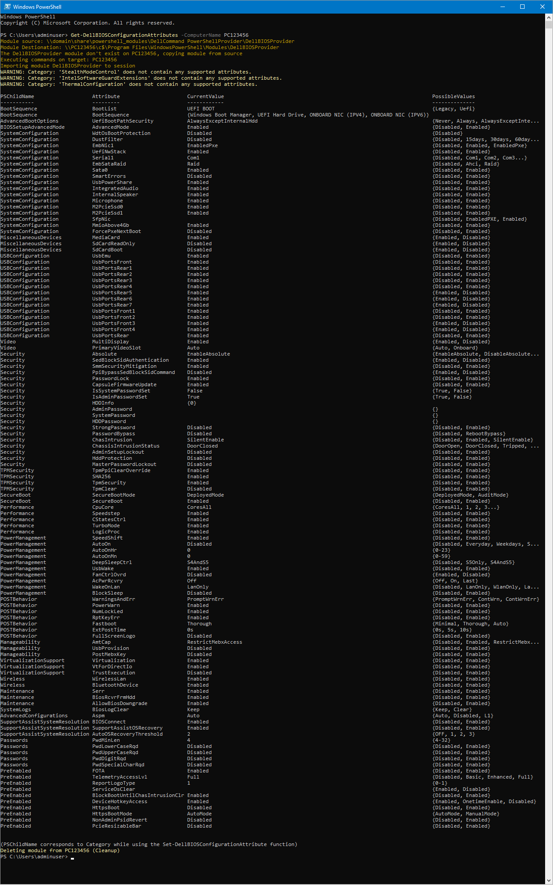

!!!!! THE SCRIPT WILL BE UPLOADED LATER TODAY !!!!!!


# RemoteDellBIOSConfiguration
A PowerShell module to view and change BIOS settings on remote Dell computers 

This module will copy the DellCommand PowerShellProvider temporary to the target machine and use that to get og set configurations attributes on the target computer's BIOS. When function it compleate the module will automaticly be removed from the target (if the module did not exist there in the first place).

**The Process**
1. Copy "DellCommand PowerShellProvider" to target computer if it is not existing.
2. Import the module in to a remote session on the target computer
3. In the same session execute get or set BIOS commands
4. Remove the module from the session
5. Delete the module from the target computer, if it was copied.

**Instructions**

- Make sure your “master machine” (the server or computer you are going to use this module from) and user account has access to the Dell computer’s C:\ drive over the network (\\hostname\c$\) and also administrative privileges locally on the remote machines.
- Download the Dell Command PowerShell Provider from the link below and extract the DellBIOSProvider folder to a share or location that your “master machine” and user has access to.
https://www.dell.com/support/home/drivers/DriversDetails?driverId=29CN5
- Extract the DellBIOSProvider folder to a share or location that your “master machine” (the server or computer you are going to run the commands from) and user has access to.
- Change the value of $script:module_source in function Set-DellBIOSProviderPaths to where DellBIOSProvider is located.

```powershell
function Set-DellBIOSProviderPaths ($ComputerName)
{
    $ErrorActionPreference = "Stop"
    $script:module_source = "\\domain\share\powershell_modules\DellCommand PowerShellProvider\DellBIOSProvider" # Where the DellCommand PowerShellProvider is located
    $script:module_destination = "\\" + $ComputerName + "\c$\Program Files\WindowsPowerShell\Modules\DellBIOSProvider"
}
```

**Functions**

```powershell
Find-DhcpServerv4ScopeID -ComputerName <dhcp server> (optional) -IPaddress <ip> -Details (optional)
Set-DellBIOSProviderPaths -ComputerName <name of target computer>
Set-DellBIOSConfigurationAttribute -ComputerName <name of target computer> -BIOSPassword <BIOS password> -Category <BIOS Category (PSChildName)> -Attribute <BIOS Attribute> -Value <New value for BIOS Attribute>

```

**Screenshots**  




**Changelog**  
* 17.02.2023
    * Release
